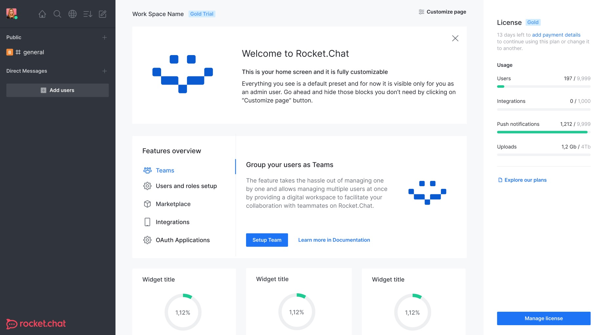

<!--
Важно: этот README был автоматически сгенерирован <https://github.com/YunoHost/apps/tree/master/tools/readme_generator>
Он НЕ ДОЛЖЕН редактироваться вручную.
-->

# Rocket.Chat для YunoHost

[](https://ci-apps.yunohost.org/ci/apps/rocketchat/)


[](https://install-app.yunohost.org/?app=rocketchat)

*[Прочтите этот README на других языках.](./ALL_README.md)*

> *Этот пакет позволяет Вам установить Rocket.Chat быстро и просто на YunoHost-сервер.*  
> *Если у Вас нет YunoHost, пожалуйста, посмотрите [инструкцию](https://yunohost.org/install), чтобы узнать, как установить его.*

## Обзор

Rocket.Chat is an open-source fully customizable communications platform developed in JavaScript for organizations with high standards of data protection.

### Features

- End to End Encryption
- Multifactor Authentication
- Customizable User Permission
- Mobile Apps for [iOS](https://apps.apple.com/app/rocket-chat/id1148741252) and [Android](https://play.google.com/store/apps/details?id=chat.rocket.android)
- Desktop Apps for [macOS](https://apps.apple.com/br/app/rocket-chat/id1086818840), [Linux](https://snapcraft.io/rocketchat-desktop) and [Windows](https://releases.rocket.chat/desktop/latest/download)

**Поставляемая версия:** 7.1.0~ynh1

**Демо-версия:** <https://cloud.rocket.chat/trial>

## Снимки экрана



## :red_circle: Анти-функции

- **Not totally free upstream**: The packaged app is under an overall free license, but with clauses that may restrict its use.

## Документация и ресурсы

- Официальный веб-сайт приложения: <https://rocket.chat/>
- Официальная документация пользователя: <https://docs.rocket.chat/guides/user-guides>
- Официальная документация администратора: <https://docs.rocket.chat/>
- Репозиторий кода главной ветки приложения: <https://github.com/RocketChat/Rocket.Chat>
- Магазин YunoHost: <https://apps.yunohost.org/app/rocketchat>
- Сообщите об ошибке: <https://github.com/YunoHost-Apps/rocketchat_ynh/issues>

## Информация для разработчиков

Пришлите Ваш запрос на слияние в [ветку `testing`](https://github.com/YunoHost-Apps/rocketchat_ynh/tree/testing).

Чтобы попробовать ветку `testing`, пожалуйста, сделайте что-то вроде этого:

```bash
sudo yunohost app install https://github.com/YunoHost-Apps/rocketchat_ynh/tree/testing --debug
или
sudo yunohost app upgrade rocketchat -u https://github.com/YunoHost-Apps/rocketchat_ynh/tree/testing --debug
```

**Больше информации о пакетировании приложений:** <https://yunohost.org/packaging_apps>
